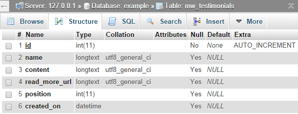

## Creating a module with database tables

In this tutorial we are going to create a module with its own database table. We will need functions to get and save data in the db and also we will need custom database table. 

For the example we are going to make a "testimonials" module to show customer testimonials.


### Create the basic files

Create new folder at `userfiles/modules/testimonials`

Every module needs the following files to work

 
|Filename  | Description|
|--------------|--------------|
|config.php  | this file the info for your module |
|index.php  | this file loads the module is dropped or opened from the frontend  |
|admin.php  | when you open the module settings from the admin or from the live edit, this file is loaded  |
|functions.php  | optional file, it is loaded on system start with the website |
|testimonials.png  | icon for your module (size 32x32) |


#### config.php
Create a file at `userfiles/modules/testimonials/config.php`
Use this file to define the name of your module and its version as it will appear in the admin panel

In your config.php you can set the `$config['tables']` array which can contain description of the db tables you want to make. 

```php
<?php
$config = array();
$config['name'] = "Testimonials";
$config['author'] = "Microweber";
$config['ui'] = true; //if set to true, module will be visible in the toolbar
$config['ui_admin'] = true; //if set to true, module will be visible in the admin panel
$config['categories'] = "content";
$config['position'] = 99;
$config['version'] = 0.1;

$config['tables'] = array(
    "testimonials" => array(
        'id' => "integer",
        'name' => "text",
        'content' => "text",
        'read_more_url' => "text",
        'created_at' => "dateTime",
        'position' => "integer"
    )
);
```

On install of the module Microweber will make those tables in the database for you. If you open the database you will see the following SQL table created. If you need control of the database fields type, read more [here](http://laravel.com/docs/5.0/schema "").  





#### admin.php
This file loads when you drop the module and click on "settings". Use the [only_admin_access](../functions/only_admin_access.md "") function to make the admin files accessible only for admin users.


Put this code in `userfiles/modules/testimonials/admin.php` 
```html
<?php only_admin_access(); ?>
<h2>This is my settings file</h2>
```


#### index.php
This file loads when you drop the module or include the module in your code.
Put this in `userfiles/modules/testimonials/index.php` and also create your css and js files and load them.

```html
<link rel="stylesheet" href="<?php print $config['url_to_module']; ?>testimonials.css" />
<script src="<?php print $config['url_to_module']; ?>testimonials.js"></script>
<div class="testimonials-wrapper">
    <h2>This is my testimonials module</h2>
</div>
```


###Loading your module

You can load your module in the code or insert it from the live edit, also open it from the admin panel.

```php
<module type="testimonials" />
```


## Lets get busy

Time to start writing some code.

Now that we have done the basics, we are going to start making our module do stuff and add an interface.

Before we make the interface we must make our functions to save and get data. 
We are also going to expose few of our functions to the api, which will allow us to make ajax calls to it.

#### functions.php

We are going to need few functions to get and save data in the database, so we will put them in this file.


Open `userfiles/modules/testimonials/functions.php` and add this code. 
```php
<?php

api_expose('save_testimonial');
function save_testimonial($data)
{
    if (!is_admin()) {
        return;
    }
    $table = "testimonials";
    return db_save($table, $data);
}

function get_testimonials($params=array())
{
    if (is_string($params)) {
        $params = parse_params($params);
    }
    $params['table'] = "testimonials";
    return db_get($params);
}

api_expose('delete_testimonial');
function delete_testimonial($params)
{
    if (!is_admin()) {
        return;
    }
    if (isset($params['id'])) {
        $table = "testimonials";
        $id = $params['id'];
        return db_delete($table, $id);
    }
}
```

Note the [api_expose](../functions/api_expose.md "") usage before the "save_testimonial" function, this allows us to call this function from http://example.com/api/save_testimonial .

As you can see those functions are just a references to the [db_get](../functions/db_get.md "db_get"), [db_save](../functions/db_save.md "db_save") and [db_delete](../functions/db_delete.md "delete_by_id").


#### admin.php 

As we have our functions ready its time for the fun part, to add the interface.

In order to make our module dynamic and able to reload different parts of it we will split it on several sub-modules.

Open `userfiles/modules/testimonials/admin.php` and add the following code to load the modules needed for adding and listing the information

```html
<?php only_admin_access(); ?>
<module type="testimonials/edit" id="edit-testimonials" />
<module type="testimonials/list" id="list-testimonials" />
```

#### edit.php 

Now you need to create `userfiles/modules/testimonials/edit.php` file which we will use to post via ajax.
```html
<?php only_admin_access(); ?>
<script>
    $(document).ready(function () {
        $("#add-testimonial-form").submit(function (event) {
            event.preventDefault();
            var data = $(this).serialize();
            var url = "<?php print api_url('save_testimonial'); ?>";
            var post = $.post(url, data);
            post.done(function (data) {
                mw.reload_module("testimonials");
                mw.reload_module("testimonials/list");
            });
        });
    });
</script>

<form id="add-testimonial-form">
  <h3>Add new testimonial</h3>
  <label class="mw-ui-label">Name</label>
  <input type="text" name="name" class="mw-ui-field">
  <label class="mw-ui-label">Content</label>
  <textarea  name="content" class="mw-ui-field"></textarea>
  <input type="submit" name="submit" value="Save" class="mw-ui-btn"/>
</form>
```

This module loads when you put `<module type="testimonials/edit" />` in your code, as we did in admin.php 

Now its time to list our testimonials. 


#### list.php 

Open `userfiles/modules/testimonials/list.php` and add this code.  

```html
<?php only_admin_access(); ?>
<script>
    function delete_testimonial(id) {
        var are_you_sure = confirm("Are you sure?");
        if (are_you_sure == true) {
            var data = {}
            data.id = id;
            var url = "<?php print api_url('delete_testimonial'); ?>";
            var post = $.post(url, data);
            post.done(function (data) {
                mw.reload_module("testimonials");
                mw.reload_module("testimonials/list");
            });
        }
    }
</script>
<?php $data = get_testimonials("no_limit=true"); ?>
<?php if ($data): ?>
    <table width="100%" class="mw-ui-table">
        <thead>
        <tr>
            <th>Name</th>
            <th>Content</th>
            <th></th>
        </tr>
        </thead>
        <tbody>
        <?php foreach ($data as $item): ?>
            <tr>
                <td><?php print $item['name'] ?></td>
                <td><?php print $item['content'] ?></td>
                <td><a class="mw-ui-btn"
                       href="javascript:delete_testimonial('<?php print $item['id'] ?>');">Delete
                    </a>
                </td>
            </tr>
        <?php endforeach; ?>
        </tbody>
    </table>
<?php endif; ?>
```

Now we have the admin part working. Its time to display the testimonials on our site. 


#### index.php
Open `userfiles/modules/testimonials/index.php` and add this code.  

```html
<link rel="stylesheet" href="<?php print $config['url_to_module']; ?>testimonials.css"/>
<script src="<?php print $config['url_to_module']; ?>testimonials.js"></script>

<?php $data = get_testimonials("no_limit=true"); ?>
<?php if ($data): ?>
    <div id="rotator_<?php print $params['id'] ?>" class="testimonials-wrapper">
        <?php foreach ($data as $item): ?>
            <div class="rotating-item">
                <h3 class="testimonial-name"><?php print $item['name'] ?></h3>
                <div class="testimonial-content"><?php print $item['content'] ?></div>
            </div>
        <?php endforeach; ?>
    </div>
<?php endif; ?>

```

When you drop the module in the live edit or type `<module type="testimonials" />`, the `index.php` file serves as the "front-end" of the module. 


 

### That's it!
 
We are ready to go. 


