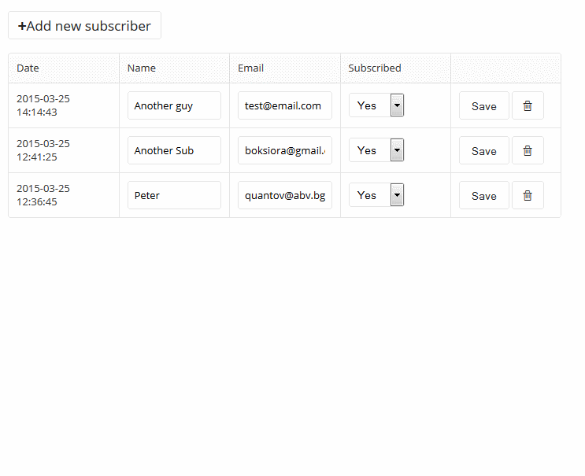

# Simple list module with database table

In this tutorial we are going to create a module with its own database table. We will need functions to get and save data in the db and also we will need custom database table. 


At a high level, here's what you'll accomplish in this tutorial:

1. Create a custom database table
2. Make module admin to manage the information in it
3. Make module front-end to display the information

 


For the purpose of this tutorial we will create a "newsletter" module to send email to our site's subscribers.


## Basics

Create new folder at `userfiles/modules/newsletter`

This example module must have the following files 

 
|Filename  | Description|
|--------------|--------------|
|config.php  | this file holds the info for your module |
|index.php  | this file loads the module is dropped or opened from the frontend  |
|admin.php  | when you open the module settings from the admin or from the live edit, this file is loaded  |
|functions.php  | optional file, it is loaded on system start with the website |


#### config.php
Create a file at `userfiles/modules/newsletter/config.php`


```php
<?php
$config = array();
$config['name'] = "Newsletter";
$config['author'] = "Microweber";
$config['ui'] = true;
$config['ui_admin'] = true;
$config['categories'] = "marketing";
$config['position'] = 99;
$config['version'] = 0.1;

$config['tables'] = array(

    "newsletter_subscribers" => array(
        'id' => "integer",
        'name' => "text",
        'email' => "text",
        'created_at' => "dateTime",
        'is_subscribed' => "integer"
    ),

    "newsletter_campaigns" => array(
        'id' => "integer",
        'name' => "text",
        'subject' => "text",
        'from_name' => "text",
        'from_email' => "text",
        'created_at' => "dateTime",
        'list_id' => "integer",
        'is_done' => "integer"
    ),

    "newsletter_campaigns_send_log" => array(
        'id' => "integer",
        'campaign_id' => "integer",
        'subscriber_id' => "integer",
        'created_at' => "dateTime",
        'is_done' => "integer"
    )
);
```


## Making the subscribers management part


#### functions.php


Create a file at  `userfiles/modules/newsletter/functions.php` and add this code. 

```php


<?php


/* SUBSCRIBER FUNCTIONS */


function newsletter_unsubscribe($params)
{
    //code...
}

function newsletter_subscribe($params)
{
    //code...
}


function newsletter_get_subscribers($params)
{
    if (is_string($params)) {
        $params = parse_params($params);
    }
    $params['table'] = "newsletter_subscribers";
    return db_get($params);
}

api_expose_admin('newsletter_save_subscriber');
function newsletter_save_subscriber($data)
{

    $table = "newsletter_subscribers";

    if (!isset($data['is_subscribed']) and !isset($data['id'])) {
        $data['is_subscribed'] = 1;
    }
    return db_save($table, $data);
}

api_expose_admin('newsletter_delete_subscriber');
function newsletter_delete_subscriber($params)
{
    if (isset($params['id'])) {
        $table = "newsletter_subscribers";
        $id = $params['id'];
        return db_delete($table, $id);
    }
}


/* EMAIL CAMPAIGN FUNCTIONS */

function newsletter_save_campaign($params)
{
    //code...
}


function newsletter_delete_campaign($params)
{
    //code...
}


function newsletter_send_campaign($params)
{
    //code...
}


```

You can open HTTP API endpoints to your functions with [api_expose_admin](../functions/api_expose_admin.md "api_expose_admin") or with  [api_expose](../functions/api_expose.md "")


#### admin.php


Create a file at  `userfiles/modules/newsletter/admin.php` and add this code.


```html


<script>
    $(document).ready(function () {
        mw.tabs(
            {
                nav: '#newsletter-admin .mw-ui-btn-nav-tabs a',
                tabs: '#newsletter-admin .mw-ui-box-content' 
            }
        );
    });
</script>
<div class="module-live-edit-settings" id="newsletter-admin">
    <div class="mw-ui-btn-nav mw-ui-btn-nav-tabs">
        <a class="mw-ui-btn active" href="javascript:;">Subscribers</a>
        <a class="mw-ui-btn" href="javascript:;">Campaigns</a>
        <a class="mw-ui-btn" href="javascript:;">Settings</a>
    </div>
    <div class="mw-ui-box">
        <div class="mw-ui-box-content" style="display: block;">
            <module type="newsletter/subscribers"/>
        </div>
        <div style="display: none;" class="mw-ui-box-content">
            <module type="newsletter/campaigns"/>
        </div>
        <div style="display: none;" class="mw-ui-box-content">
            <module type="newsletter/campaigns"/>
        </div>
    </div>
</div>


```


#### subscribers.php


Create a file at  `userfiles/modules/newsletter/subscribers.php` and add this code.


```html
<?php only_admin_access(); ?>
<script>
function edit_subscriber(form){
	 var data = mw.serializeFields(form);
	 $.ajax({
        url: mw.settings.api_url + 'newsletter_save_subscriber',
        type: 'POST',
        data: data,
        success: function (result) {
			mw.notification.success('Subscriber saved');
			$('#add-subscriber-form').hide();
			$('#add-subscriber-form')[0].reset();
			
			//reload the modules
			mw.reload_module('newsletter/subscribers_list')
			mw.reload_module_parent('newsletter'); 
         }
    });
	return false;
}
function delete_subscriber(id){
	var ask = confirm("Are you sure you want to delete this subscriber?");
	if (ask == true) {
		 var data = {};
		 data.id = id;
		 $.ajax({
			url: mw.settings.api_url + 'newsletter_delete_subscriber',
			type: 'POST',
			data: data,
			success: function (result) {
				mw.notification.success('Subscriber deleted');
				
				//reload the modules
				mw.reload_module('newsletter/subscribers_list')
				mw.reload_module_parent('newsletter')
			 }
		});	 
	}
	 
	 
	return false;
}
</script>

<a class="mw-ui-btn mw-ui-btn-icon" href="javascript:;" onclick="$('#add-subscriber-form').show()"> <span class="mw-icon-plus">Add new subscriber</span> </a>
<form id="add-subscriber-form" onSubmit="edit_subscriber(this); return false;" style="display:none">
  <div class="mw-ui-field-holder">
    <label class="mw-ui-label">Subscriber Name</label>
    <input name="name" type="text" class="mw-ui-field" />
  </div>
  <div class="mw-ui-field-holder">
    <label class="mw-ui-label">Subscriber Email</label>
    <input name="email" type="text" class="mw-ui-field" />
  </div>
  <button type="submit" class="mw-ui-btn">Save</button>
</form>
<div class="mw-clear"></div>
<br />
<module type="newsletter/subscribers_list" />

```
 
#### subscribers_list.php


Create a file at  `userfiles/modules/newsletter/subscribers_list.php` and add this code.


```html

<?php only_admin_access(); ?>
<?php 
$subscribers_params=array();
$subscribers_params['no_limit'] = true;
$subscribers_params['order_by'] = "created_at desc";
$subscribers = newsletter_get_subscribers($subscribers_params); 
?>
<?php if($subscribers): ?>

<table width="100%" border="0" class="mw-ui-table" style="table-layout:fixed">
  <thead>
    <tr>
      <th>Date</th>
      <th>Name</th>
      <th>Email</th>
      <th>Subscribed</th>
      <th width="140px">&nbsp;</th>
    </tr>
  </thead>
  <tbody>
    <?php foreach($subscribers as $subscriber): ?>
    <tr id="newsletter-subscriber-<?php print $subscriber['id']; ?>">
      <td><?php print $subscriber['created_at']; ?></td>
      <td><input type="text" class="mw-ui-field" name="name" value="<?php print $subscriber['name']; ?>" /></td>
      <td><input type="email" class="mw-ui-field" name="email" value="<?php print $subscriber['email']; ?>" /></td>
      <td><select class="mw-ui-field mw-ui-field-medium" name="is_subscribed">
          <option value="1" <?php if($subscriber['is_subscribed']): ?>  selected <?php endif; ?> >Yes</option>
          <option value="0" <?php if(!$subscriber['is_subscribed']): ?>  selected <?php endif; ?> >No</option>
        </select></td>
      <td><input type="hidden" name="id" value="<?php print $subscriber['id']; ?>" />
        <button class="mw-ui-btn" onclick="edit_subscriber('#newsletter-subscriber-<?php print $subscriber['id']; ?>')">Save</button>
        <a class="mw-ui-btn mw-ui-btn-icon" href="javascript:;" onclick="delete_subscriber('<?php print $subscriber['id']; ?>')"> <span class="mw-icon-bin"></span> </a></td>
    </tr>
    <?php endforeach; ?>
  </tbody>
</table>
<?php endif; ?>


```

The above code will get you the results of the following preview




Now that we have the basic CRUD for adding subscibers, we are going to make our newsletter campaigns management. This will be the place where we will create newsletters and send them to our subscribers. 
