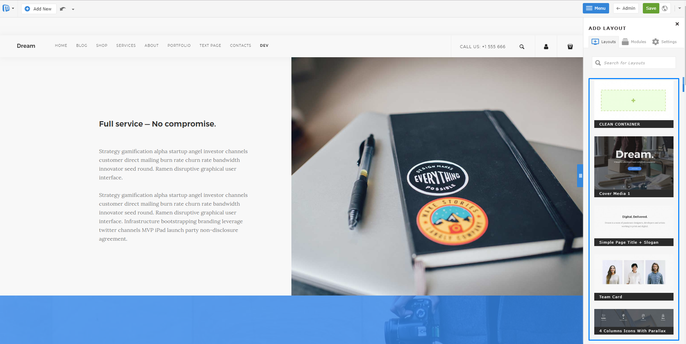

# Creating Template Guide
Before start developing you must disable Compile assets option from **Admin panel -> Settings -> Advanced -> Internal settings -> Compile api.js - NO**

**Example path to settings:**
http://yourwebsite.com/admin/view:settings#option_group=advanced

## Begining
Making a Microweber template is easy. You just have to make a new folder in userfiles/templates/. The template folder name must be in lowercase, and must not contain spaces or special characters, besides unserscore and dash.

Lets make a folder called **starter** at "*userfiles/templates/starter*"

## Setting up the basic files.
Make few files in your new folder.
```
/userfiles
    /templates
        /starter
           config.php
           header.php
           index.php
           footer.php
           clean.php
           /assets
           /layouts
           /modules
              /layouts/templates/skin-1.php
              /layouts/templates/skin-1.png
```
In **/assets** folder you can put your Images, CSS and JS files.

### Set the template name in the config.php file
Open "*userfiles/templates/starter/config.php*" and put this code

## Making header and footer
Every template needs header and footer files. They can be loaded within the template layouts to add the common styles and scripts needed for the website.

#### header.php

```
<!DOCTYPE HTML>
<html prefix="og: http://ogp.me/ns#">
    <head>
        <title>{content_meta_title}</title>
        <meta http-equiv="Content-Type" content="text/html; charset=UTF-8">
        <meta http-equiv="X-UA-Compatible" content="IE=edge">
        <meta name="viewport" content="width=device-width, initial-scale=1, user-scalable=no">

        <!--  Site Meta Data  -->
        <meta name="keywords" content="{content_meta_keywords}">
        <meta name="description" content="{content_meta_description}">

        <!--  Site Open Graph Meta Data  -->
        <meta property="og:title" content="{content_meta_title}">
        <meta property="og:type" content="{og_type}">
        <meta property="og:url" content="{content_url}">
        <meta property="og:image" content="{content_image}">
        <meta property="og:description" content="{og_description}">
        <meta property="og:site_name" content="{og_site_name}">

        <!--  Loading CSS and Javascripts  -->
        <link rel="stylesheet" type="text/css" href="<?php print template_url(); ?>assets/css/style.css" />
        <script type="text/javascript" src="<?php print template_url(); ?>assets/js/scripts.js"></script>
    </head>
<body>

    <!-- YOUR HEADER CONTENT -->
```

You can use the [template_url()](/functions/template_url.md "") function to get the URL to the template folder. Also there is [template_dir()](/functions/template_dir.md "") for the full filesystem path of the template.

The curly brackets text like ```{content_meta_title}``` is replaced with the appropriate content when the site is rendered.

#### footer.php
Put any closing tags in the footer and also common content like menu, copyright info, etc.
```
      <!-- YOUR FOOTER CONTENT -->

    </body>
</html>
```

#### Adding navigation menus, logo, etc.
Its common that we put a navigation in the site header and also design elements that are used on all pages. Also we can put global editable regions, so the user can change its logo and text in the header.

You can load modules inside your template with the tag.

```
<!--  ... </head><body> ... continued from header.php  -->
    <div id="header">
        <div class="edit" rel="global" field="template_name_header">
            <h1><a href="<?php print site_url(); ?>">My template</a></h1>
            <module type="menu" name="header_menu" id="main-navigation" template="navbar"  />
        </div>
    </div>
```
```
<!--  ... continued from footer.php  -->
        <div id="footer" class="edit" rel="global" field="template_name_footer">
            <div>Copyright &copy; <?php print date('Y');  ?> All rights reserved</div>
            <module type="menu" name="footer_menu" />
        </div>
    </body>
</html>
```
## Module layouts
The Layouts module serves to build a page with a drag & drop function from the right sidebar. Through it, you can easily and quickly build your page.


### Creating module layouts
The creating of module layouts is easy. You have to create folder **layouts/templates** in your template folder, which must contain **skin-1.php** and **skin-1.png** where **1** is the increment number of layout. If you want to create more second or third layout, their names must be skin-2.php and skin-3.php with screenshots skin-2.png and skin-3.png

The structure of three must be the following:

```
/userfiles
    /templates
        /starter
           /modules
              /layouts/templates/skin-1.php
              /layouts/templates/skin-1.png
```

The structure of module layout file must be the following:

**skin-1.php**

```
<?php
/*
type: layout
name: Layout title
description: Layout description
position: 1
*/
?>

<div class="edit" field="layout-skin-1-<?php print $params['id'] ?>" rel="module">
    Yout layout content here
</div>
```

We recommend you to use the following structure for the first layout of your template because it's contain structure with Clean container which you can use to Drag & Drop elements inside.

```
<?php /*
type: layout
name: Clean Container
position: 1
*/
?>

<div class="edit clean-container nodrop" field="layout-skin-1-<?php print $params['id'] ?>" rel="module">
    <div class="container allow-drop">
        <div class="mw-row">
            <div class="mw-col" style="width:100%">
                <div class="mw-col-container">
                    <div class="mw-empty"></div>
                </div>
            </div>
        </div>
    </div>
</div>
```

For each next layout you can use the following structure:

**skin-2.php**

```
<?php /*
type: layout
name: Jumbotron
description: Layout
position: 2
*/
?>

<div class="nodrop safe-mode edit" field="layout-skin-2-<?php print $params['id'] ?>" rel="module">
    <div class="container">
        <div class="row">
            <div class="col-md-12">
                <div class="jumbotron">
                    <h1> Hello, world! </h1>
                    <p> This is a template for a simple marketing or informational website. It includes a large callout called the hero unit and three supporting pieces of content. Use it as a
                        starting
                        point to create something more unique. </p>
                    <p><a class="btn btn-primary btn-large" href="#">Learn more</a></p>
                </div>
            </div>
        </div>
    </div>
</div>
```

On the top of structure you see **name** label. The value will be shown as Title of the layout in right sidebar. The label **position** serv for ordering of layouts.

Bellow on the first line from the code you will see ```field="layout-skin-2-<?php print $params['id'] ?>"``` . The number in red must be the increment number of your layout. This is the same number like on the filename of this layout.

Helper classes

We have some helper classes for different cases.

```
class="nodrop"
class="allow-drop"
class="safe-mode"
class="safe-element"
class="cloneable"
```

The class **nodrop** disables Drag & Drop in the element.

If you have wrapper with **nodrop** you can use allow-drop on inner elements to allow Drag & Drop function inside.

Example for **nodrop** and **allow-drop**:

```
<div class="nodrop">
    YOU CAN NOT DROP HERE
    <div class="allow-drop">
        YOU CAN DROP HERE
    </div>
</div>
```

If you have complex structure of code you can use **safe-mode** to prevent breaking the structure.
You can use this class only for block elements.

For inline elements which must not be deleted, you can use **safe-element**.

Example for safe-mode and safe-element:

```
<div class="row wide-grid safe-mode">
    <div class="col-sm-3 col-xs-6 cloneable">
        <div class="feature feature-1 text-center">
            <i class="icon icon--lg icon-Bodybuilding safe-element"></i>
            <h3>16,000+</h3>
            <span class="safe-element"><em><?php _lang("Customers strong"); ?></em></span>
        </div>
    </div>
</div>
```

The **cloneable** class will show you tools over the element which allows you to duplicate, remove or move the elements.


You can also use **style="background-image: url('http://image.url.path');"**. This inline style will show you handles for changing the background image of selected element.


## Template layouts
Each template is made of "layouts"

Think of layouts as "pages" of your template. You can have just one layout... or as many as you like.

The vast majority of sites need more complex structure and that can be accomplished by adding a variety of page layouts to your template folder.

Microweber allows you to have different layouts for different pages in your site. Although each page layout can be different you can define common regions such as a "header", "footer" and a "sidebar" to share among layouts.

Every template can have multiple layouts. Besides a simple page, you can make different page layouts that can be used by the users and chosen at the page creation process.

Example of layouts usage is to allow the user to have different looking pages for their blog, shop or contact us


### Making layouts
The layouts are located in your template folder or its sub-folders.

For example: "*userfiles/templates/starter/layouts/*"

The layout files are simply php files located in any sub-folder of your template. Microweber recognizes a layout file by scanning the template folder for php files which contains the following code in them.

```
<?php
/*
  type: layout
  name: My layout
  content_type: static
  description: My sample layout
*/
?>
```

Those layouts can show content from the current page or from other pages. They can even have shared editable regions. All you need to do is include your modules and write your code in the layout file.

#### index.php
"*userfiles/templates/starter/index.php*"

The index.php file is used as a homepage layout. This is your first layout. Layouts can be different for every page and this is defined from the admin, on the create page window.

```
<?php
/*
  type: layout
  content_type: static
  name: Home
  description: Home layout
*/
?>
<?php include template_dir(). "header.php"; ?>
    <div class="edit" rel="content" field="template_name_content">
        <div class="container nodrop">
            <h2>Welcome to my homepage</h2>
            <p>This is my Microweber template</p>
            <p>You can edit this text, just click here and start typing</p>
        </div>


        OR
       
        <!-- Where skin-1 is name of the layout filename from the sidebar  -->
        <module type="layouts" template="skin-1" />
    </div>
<?php include template_dir(). "footer.php"; ?>
```

We have created editable field in our layout by adding class edit to html element of our choice.

#### clean.php
"*userfiles/templates/starter/clean.php*"

This layout is used as default for pages and also as a fallback layout if no other layout can be found.

```
<?php
/*
type: layout
content_type: static
name: Clean
position: 2
description: Clean layout
*/
?>
<?php include template_dir(). "header.php"; ?>
    <div class="edit" rel="content" field="template_name_content">
        <div class="container nodrop">
            <p>This is my text</p>
        </div>

        OR

        <!-- Where skin-1 is name of the layout filename from the sidebar  -->
        <module type="layouts" template="skin-1" />
    </div>
<?php include template_dir(). "footer.php"; ?>
```

### Creating blog layout
In a site where we want to have separation of how the pages and the posts look we will need to create different layouts for them.

Here, for example, is how we would make a layout for a blog page with a posts module and a sidebar.

Make a new file at "*userfiles/templates/starter/layouts/blog.php*", this file will load when you create new page with the "Blog" layout.

#### blog.php

```
<?php
/*
  type: layout
  content_type: dynamic
  name: Blog
  description: Blog layout
*/
?>
<?php include template_dir(). "header.php"; ?>

    <div class="edit" rel="content"  field="template_name_content">
        <div class="container">
            <div class="blog-content">
                <h2>Check out my posts</h2>
                <module type="posts" />
            </div>

            <div class="blog-sidebar">
                <?php include template_dir() . "layouts/blog_sidebar.php"; ?>
            </div>
        </div>
    </div>

<?php include template_dir(). "footer.php"; ?>
```

#### blog_sidebar.php

```
<div class="edit" rel="inherit" field="template_name_sidebar">
    <h2>My sidebar</h2>
    <module type="categories" />
</div>
```

### Creating layout for post
We can have an inner page to show the posts added to our blog. Create a file blog_inner.php at userfiles/templates/starter/layouts/blog_inner.php to show posts added the blog layout pages. You can also make a file called post.php or inner.php in the root of the template folder and use it as a default for posts in all pages.

#### blog_inner.php

```
<?php include template_dir() . "header.php"; ?>

<div class="edit" rel="content" field="template_name_content">
    <div class="container" id="blog-container">
        <div id="blog-content-<?php print CONTENT_ID; ?>">
            <div class="row">
                <div class="col-sm-9" id="blog-main-inner">
                    <h3 class="edit" field="title" rel="content">Page Title</h3>
                    <module data-type="pictures" data-template="slider" rel="content"/>
                    <div class="edit" field="content_body" rel="content">
                        <div class="element">
                            <p align="justify">This text is set by default and is suitable for edit in real time. By
                                default the drag and drop core feature will allow you to position it anywhere on  the site. Get creative, Make Web.</p>
                        </div>
                    </div>

                    <module data-type="comments" data-template="default" data-content-id="<?php print CONTENT_ID; ?>"/>
                </div>

                <div class="col-sm-3" id="blog-sidebar">
                    <?php include template_dir() . "layouts/blog_sidebar.php"; ?>
                </div>
            </div>
        </div>
    </div>
</div>

<?php include template_dir() . "footer.php"; ?>
```

### Creating shop layout
If we want to have a shop pages in out template we will need to make a shop layout and a layout to display products from the shop.

The shop layout is created by including is_shop property in the definition of the layout file. You can add products only to pages that are defined as shop by using a shop layout.

Make a new file at userfiles/templates/starter/layouts/shop.php, this file will load when you create new page and choose the "Shop" layout.

#### shop.php

```
<?php
/*
type: layout
content_type: dynamic
name: Shop
is_shop: y
description: shop layout
position: 4
*/
?>
<?php include template_dir() . "header.php"; ?>

<div class="edit" rel="content" field="template_name_content">
    <div class="container nodrop">
        <div class="row" id="shop-products-conteiner">
            <div class="col-sm-12">
                <h1>Shop</h1>
            </div>

            <div class="col-sm-8">
                <module type="shop/products" limit="18" description-length="70"/>
            </div>

            <div class="col-sm-4">
                <?php include template_dir() . 'layouts' . DS . "shop_sidebar.php"; ?>
            </div>
        </div>
    </div>
</div>

<?php include template_dir() . "footer.php"; ?>
```

#### shop_sidebar.php
```
<div class="edit allow-drop" field="template_name_shop_sidebar" rel="inherit">
    <h4 class="sidebar-title">Shop Categories</h4>
    <module type="categories" content_id="<?php print PAGE_ID; ?>"/>
</div>
```

As you may notice we have loaded the "categories"module in sidebar and "shop/products" module in our layout

### Creating product layout
We can want to have a custom layout to show each of our products. Create a file shop_inner.php at "*userfiles/templates/starter/layouts/shop_inner.php*" to show products added the shop pages. You can also make a file called product.php in the root of the template folder and use it as a default for products in all pages that doesn’t have inner layout.

#### shop_inner.php

```
<?php include template_dir() . "header.php"; ?>

<div class="edit" rel="content" field="template_name_content">
    <div class="container nodrop">
        <div class="row">
            <div class="col-sm-8">
                <h2 class="edit" field="title" rel="post">Product inner page</h2>
                <hr>
                <div class="row">
                    <div class="col-md-6">
                        <div class="mw-col-container">
                            <module type="pictures" rel="content" template="product_gallery"/>
                        </div>
                    </div>

                    <div class="col-md-6">
                        <div class="mw-col-container">
                            <div class="product-description">
                                <div class="edit" field="content_body" rel="post">
                                    <p class="element">This text is set by default and is suitable for edit in real
                                        time. By default the drag and drop core feature will allow you to position it
                                        anywhere on the site. Get creative &amp; <strong style="font-weight: 600">Make
                                            Web</strong>.</p>
                                </div>
                                <module type="shop/cart_add"/>
                            </div>
                        </div>
                    </div>
                </div>

                <br/><br/>
                <h4 class="element sidebar-title">Related Products</h4>
                <module type="shop/products" related="true" limit="3"/>
                <p class="element">&nbsp;</p>
            </div>

            <div class="col-sm-4">
                <?php include_once "shop_sidebar.php"; ?>
            </div>
        </div>
    </div>
</div>

<?php include template_dir() . "footer.php"; ?>
```

### Creating checkout layout
You have to create a file checkout.php in root template folder /starter/checkout.php
The file must contain the following code:


#### checkout.php
```
<?php include template_dir() . "header.php"; ?>

<div class="edit" rel="content" field="template_name_content">
    <div class="container nodrop">
        <h2>Complete your order</h2>
        <module type="shop/checkout" id="cart_checkout"/>
    </div>
    <!-- DONT REMOVE -->
</div>

<?php include template_dir() . "footer.php"; ?>
```

Here we loaded the module "shop/checkout".


That's all.

You can download our Starter template from this address: [https://github.com/microweber-templates/starter](https://github.com/microweber-templates/starter "")