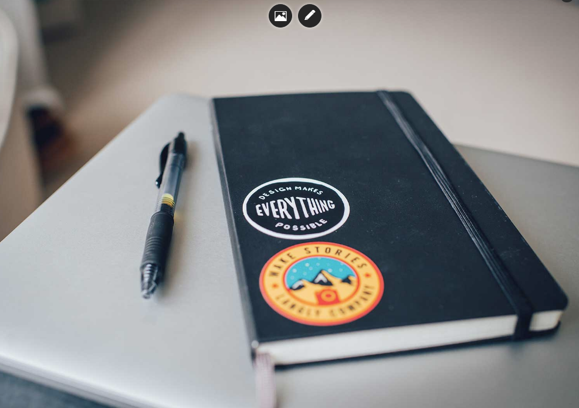

# Tips
## 1. Show handles on background image

If you want to show the handles for changing background image you have to add the style inline

For example: ```style="background-image: url('your/image/path.jpg');"```

This inline style will show you handles for changing the background image of selected element.

Don't forget that the tag must be in editable area!



## 2. Load modal with content

You can show modal with content by clicking of element.

You have to set an attribute "*data-mw-dialog*" of the element you want to click:

For example:

```
data-mw-dialog="image.jpg" //Path to image
data-mw-dialog="http://google.com" //URL to website
data-mw-dialog="#some-element" //ID of element
```

## 3. Helper classes

We have some helper classes for different cases.

```
class="nodrop"
class="allow-drop"
class="safe-mode"
class="safe-element"
class="cloneable"
```

The class **nodrop** disables Drag & Drop in the element.

If you have wrapper with **nodrop** you can use allow-drop on inner elements to allow Drag & Drop function inside.

Example for **nodrop** and **allow-drop**:

```
<div class="nodrop">
    YOU CAN NOT DROP HERE
    <div class="allow-drop">
        YOU CAN DROP HERE
    </div>
</div>
```

If you have complex structure of code you can use **safe-mode** to prevent breaking the structure.
You can use this class only for block elements.

For inline elements which must not be deleted, you can use **safe-element**.

Example for safe-mode and safe-element:

```
<div class="row wide-grid safe-mode">
    <div class="col-sm-3 col-xs-6 cloneable">
        <div class="feature feature-1 text-center">
            <i class="icon icon--lg icon-Bodybuilding safe-element"></i>
            <h3>16,000+</h3>
            <span class="safe-element"><em><?php _lang("Customers strong"); ?></em></span>
        </div>
    </div>
</div>
```

The **cloneable** class will show you tools over the element which allows you to duplicate, remove or move the elements.


