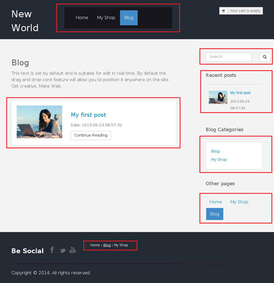

## Modules guide

The modules act as independent containers of information. They can be reused across pages. Modules can include other modules as "building blocks" and can contain any functionality.

The following picture shows how the modules are used to make a template.

 
 

You can reload every module of the fly and there is no need to reload the whole page in order to see your updated content.

Modules are as flexible as PHP is, with them you can modify the whole application. You can add functions, routing, hooks, contollers, models, etc.

Modules can contain editable regions, so you can make a fancy banner module which can have editable text from the "live edit"

Modules also can contain other modules, so you can make entirely new module that consists of combination of existing modules. 

**Only few modules are documented for now**

